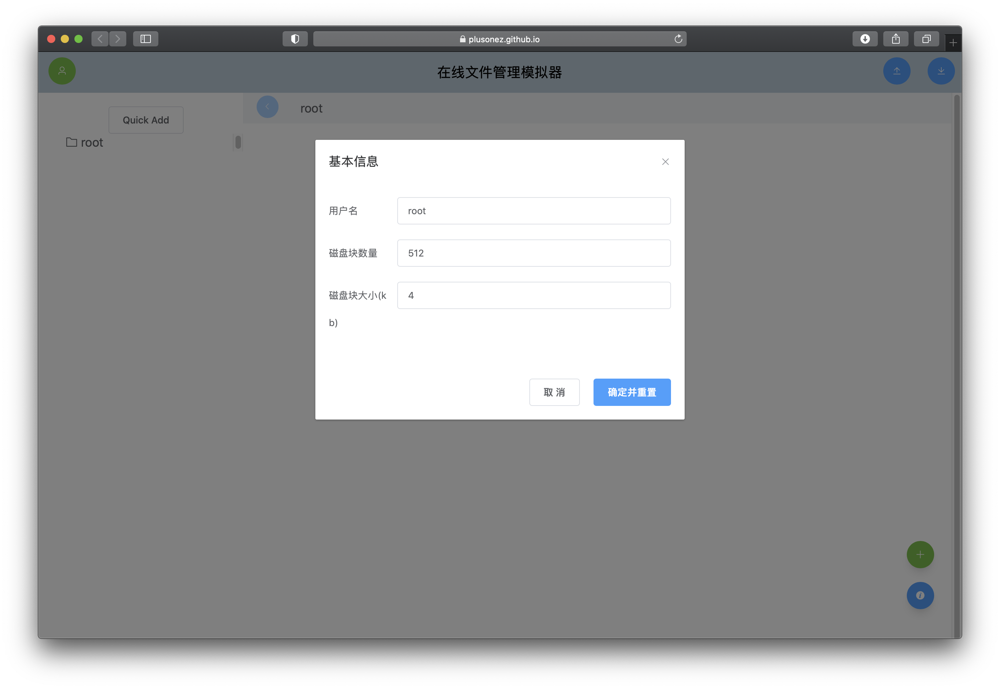
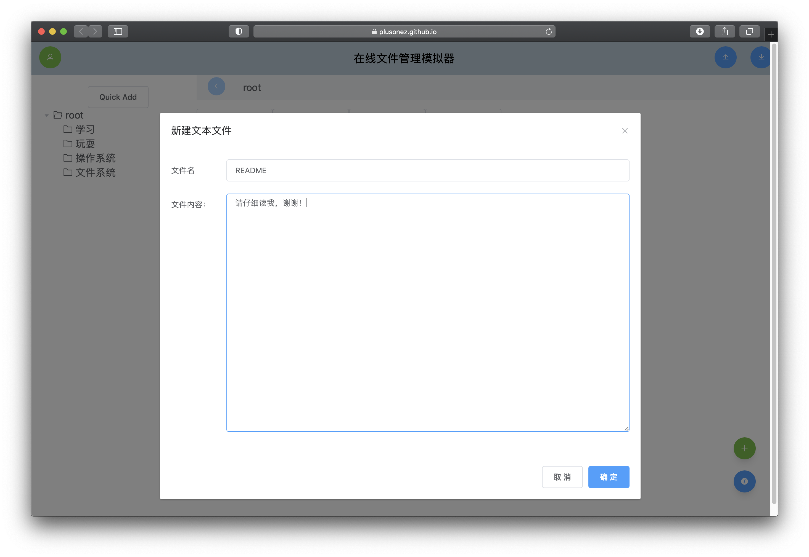
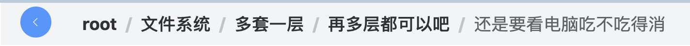
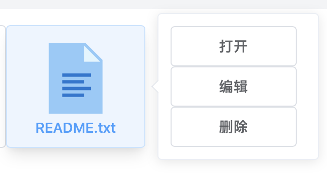
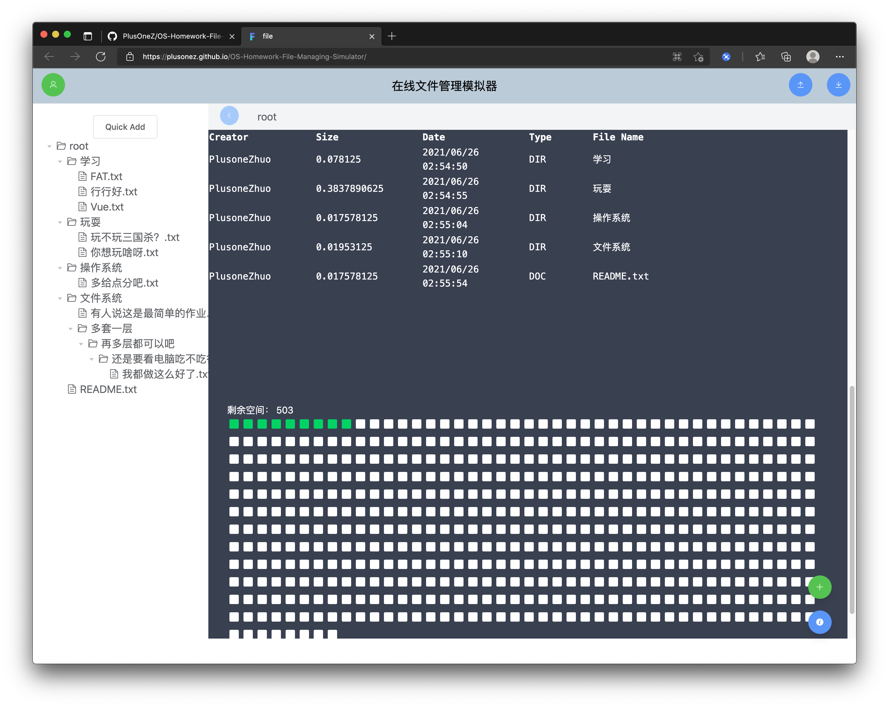

# Browser Based File Management Simulator

[toc]

This is a file management simulator based on bit-table technology implemented in Vue.js, Element Plus and Tailwindcss.

Tongji SSE Operating System Course Assignment 3.

See Assignment 1 [here](https://github.com/PlusOneZ/OS-Homework-Elevator-Dispatching).
See Assignment 2 [here](https://github.com/PlusOneZ/OS-Homework-Memory-Allocation)

The [github-page](https://plusonez.github.io/OS-Homework-File-Managing-Simulator/) of this repository is an online deployment of this simulator. Check that out!


## Project setup
```
npm install
```

### Compiles and hot-reloads for development
```
npm run serve
```

### Compiles and minifies for production
```
npm run build
```

### Lints and fixes files
```
npm run lint
```

### Customize configuration
See [Configuration Reference](https://cli.vuejs.org/config/).


# User Manual

This is a browser based **file system**. Different from those file
management system running on your Operating System, this browser side
app **simulates** the action done with the manipulations of file.

At logged-on, a dialog will show, and you can personalize parameters of the system.



### Recover from Existing Working Directory

When logged in, you will be under `root/` directory, and there will be nothing under that directory. by clicking the top right button, you can upload the previous-saved file information and recover the directory from that.

The button next to the *upload* is *download*.


### Creating a Folder / Document

Buttons at bottom right corner is *new file* and *show directory information*. Click the green button and select a file type to add.



### Browse through Folders and Documents

**Double click** either the file icon or tree widget item means **open**.

You can use the path at the navigator bar to do the navigation too.



### Right Click

By right-clicking a file icon, the popover menu will appear. You can select either to *open*, *edit* or *delete* one item.



### Directory Information

Single click the blue button at bottom right corner.


