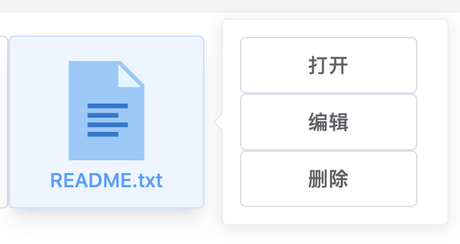

# 网页文件管理系统模拟器

[toc]

本项目是一个基于 Vue.js 前端框架的网页端文件管理系统模拟器。以下是项目的介绍。

项目 Github 网址：[https://github.com/PlusOneZ/OS-Homework-File-Managing-Simulator](https://github.com/PlusOneZ/OS-Homework-File-Managing-Simulator)

## 项目安装和在线访问

通过几个指令可以完成项目环境的搭建和本地部署，首先需要确保环境中安装了 [Node.js](https://nodejs.org/en/)。

### 配置

```shell
npm install
```

### 本地调试

```shell
npm run serve
```

### 生成部署文件

```shell
npm run build
```

### 访问在线部署

推荐的方式是访问[我部署在 Github Page 上的网页](https://plusonez.github.io/OS-Homework-File-Managing-Simulator/)：https://plusonez.github.io/OS-Homework-File-Managing-Simulator/。

在提交的文件夹中，有一个 [example.json](../example.json) 文件，可以将该文件上传至模拟器中，方便测试功能。

## 设计方案

本项目是基于浏览器端的文件管理系统，在浏览器端，系统的内存概念实际上被弱化很多。更多的方面是界面元素如何根据浏览器运行脚本内部的数据变化所产生的逻辑。

本项目使用了一个 JavaScript 对象储存文件目录信息（是树形的，因为是用其他方式有些南辕北辙），另外对于磁盘信息，也使用了一个对象。这两者构建了项目两个视图的 UI 结构：文件视图和 FAT 类命令行视图。

FAT 内由于不能使用指针，因此只记录了创建时间、创建用户、文件大小、创建时间、文件类型、被分配到的块以及文件名的信息。文件对应的块因为没有找到好的方式所以并未呈现在界面上。

在磁盘管理模块，我记录了位表、剩余空间、空闲空间指针的信息。

在创建或是修改文件时，都会检查文件的大小，文建会以块的单位被分配到磁盘空间。每个文件最少占一个块并且块不能由多个文件共享，被占用的块用绿色标记。文件使用的块增多，就会在原有基础上分配尽可能连续的块。减少或是文件被删除，块的状态会再次被标记为"可用"（白色）。

## 使用说明

进入系统，首先会有个性化参数设置以及命名要求。


### 恢复之前的工作

开始时，用户位于 'root/' 文件夹下，并且系统内现在还没有文件或目录。通过点击右上方的按钮，可以上传相应的缓存文件供文件系统解析，恢复之前的内容。右侧是上传，左侧是下载。


### 新建文件

右下角的按钮分别是“添加文件”和“展示 FAT 数据”，点按绿色按钮，并选择“文档”，就可以输入文档标题和内容以添加。


### 浏览目录

不论是在左侧的树形图中，还是在中间的文件图标视图，**双击**的动作都意味着“打开”。采用双击是希望模仿大多数操作系统的文件访问方式。双击文件夹，浏览的目录就会随之改变。

此外，主页面顶部还提供了根据路径访问文件夹和退回的功能，单点粗体文件目录就能访问当前目录之上的层级。


### 右击动作

右击一个文件，会弹出一个操作框，提供了文件的相应操作。需要注意的是，双击文档文件意味着读取而不是修改，而右击则可选择修改/写入。



### FAT 界面

点击右下角蓝色按钮可以看见 FAT 中的内容。


# 实现细节

创建步骤是最主要的步骤，这里展示创建文件的一系列逻辑代码，已经做了相应的简化。

```javascript
addFile(label, type, nodeKey, docContent) {
  var key = getNewPath()  // 产生新路径标识符

  // 判断目录下是否已有同名文件
  if (this.$refs.tree.getNode(key)) {
    console.log("duplicate")
    ElMessage({message: '创建失败，已经存在同名文件。'})
    return false
  }

  var data = { /* 一系列数据，构成文件对象 */ }
  
  let blockNeeded = calculateBlocks(data)  // 计算所需的块数

  // 创建步骤，首先要判断是否够空间
  if (((data.type === DOC) && this.allocateBlocks(blockNeeded, data)) || data.type === DIRECTORY) {
    this.insertSameLevel(data, nodeKey)
    ElMessage({
      showClose: true,
      message: '创建成功！',
      type: 'success'
    })
  }
  
  // 改变夫级目录记录的尺寸大小
  setTimeout(() => {
    if (data.size > 0) {
      this.$emit('changeSizeOfPath', data.key, data.size)
    }
  }, 500)
}
```

# 优势与不足

## 优势

* 基于浏览器，大家都能访问。
* 无需本地部署，但是应用是无服务的。
* 外观和界面切换设计合理。
* 实现了存储到文件下次读取的功能。

## 不足

* 不能实际模拟磁盘空间的管理，只能通过控制一些 JavaScript Object 来模仿这些行为。
* 有些界面下的操作计较繁琐。
* 不能把数据真正存到磁盘中，只能通过下载的方式存到本地。
